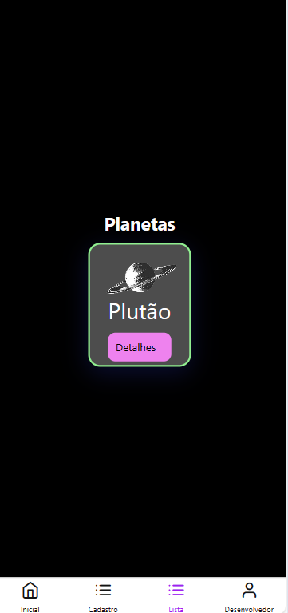

<h1 align="center"> Exercício Planetas</h1>
<h1 align="center">
    <a href="https://reactnative.dev/">🔗 React Native</a>
   
</h1
    <h1 aling="center"> Imagens do site</h1>
    <h1 aling="center"> Pagina sobre o desenvolvedor</h1>
   

<h1 aling='center'> Página Home</h1>

<h1 aling='center'> Formulario</h1>

<h1>Lista de planetas</h1>

<h1>Detalhamento de planetas</h1>

## Tecnologias Utilizadas: Rect Native, Biblioteca Botton Tab, Androi Studium, VS code, JavaScript, CSS.

## Descrição: Nesse aplicativo permite o usuário a fazer uma lista de planeta dentro do contexto em que ele é um navegador e quer fazer uma lista de planetas para navegar.

Bibliotecas Utilizadas:

##Inputs de cor:

npm install react-native-color-picker --save

npm install @react-native-community/slider

##Input de data:

npm install @react-native-community/datetimepicker --save

##Navegação:

npm install @react-navigation/native

npm install react-native-screens react-native-safe-area-context

npm install @react-navigation/bottom-tabs
